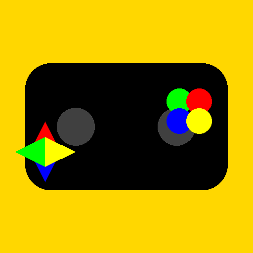

# 📱 AltStore EU Deployment Guide - Your First iOS Launch

## AltStore: The EU's Leading Alternative App Store

### **Why AltStore is Perfect for Your EU Launch:**

- ✅ **DMA Compliant**: Fully legal under EU Digital Markets Act
- ✅ **No Developer Fees**: $0 cost (vs Apple's $99/year)
- ✅ **Instant Deployment**: No review process or waiting
- ✅ **EU Focus**: Designed for European users and developers
- ✅ **Free Distribution**: Keep 100% of any revenue
- ✅ **Growing User Base**: Thousands of EU users already using it

---

## 🛠️ **Step-by-Step AltStore Deployment**

### **Phase 1: Prerequisites Setup (30 minutes)**

#### **1. Install Xcode (Free)**
```bash
# On your MacBook - Xcode is free from App Store
# Download and install Xcode 15+
# No Apple Developer Program required!
```

#### **2. Install Capacitor Dependencies**
```bash
# Install Node.js and Capacitor CLI
brew install node
npm install -g @capacitor/cli

# Verify installations
node --version    # Should be 18+
npm --version     # Should be 9+
cap --version     # Should show Capacitor CLI
```

#### **3. Set Up Your Capacitor Project**
```bash
# If not already done, create Capacitor project
cd /path/to/games-app
npm init -y
npm install @capacitor/core @capacitor/ios @capacitor/android

# Initialize Capacitor (if not done)
npx cap init "Games Collection" "com.yourcompany.games" --web-dir .

# Add iOS platform
npx cap add ios

# Copy your web app to www folder (if not done)
mkdir -p www
cp -r * www/ 2>/dev/null || true  # Copy web files
```

### **Phase 2: Build Your iOS App (1-2 hours)**

#### **1. Open iOS Project in Xcode**
```bash
# Sync web assets and open Xcode
npx cap sync ios
npx cap open ios
```

#### **2. Configure Signing (FREE - No Developer Account!)**
In Xcode:
1. **Select your project** in the Project Navigator
2. **Select your app target**
3. **Go to "Signing & Capabilities" tab**
4. **Uncheck "Automatically manage signing"**
5. **Select your free Apple ID** from the dropdown
6. **Xcode will create a free development certificate**

#### **3. Configure App Details**
In Xcode project settings:
- **Display Name**: Games Collection
- **Bundle Identifier**: com.yourcompany.games
- **Version**: 1.0.0
- **Build**: 1

#### **4. Add Required Permissions**
In `Info.plist`:
```xml
<key>NSAppTransportSecurity</key>
<dict>
    <key>NSAllowsArbitraryLoads</key>
    <true/>
</dict>
```

#### **5. Build for Device**
In Xcode:
1. **Select your connected iPhone/iPad** (or simulator)
2. **Product → Build For → Testing**
3. **Wait for build to complete**

#### **6. Archive and Export .ipa**
In Xcode:
1. **Product → Archive**
2. **Select the archive** and click "Distribute App"
3. **Choose "Development"** distribution method
4. **Select your free development team**
5. **Export to a folder** on your Mac
6. **Find the .ipa file** (GamesCollection.ipa)

---

## 🌐 **Phase 3: Web Hosting Setup (30 minutes)**

### **1. Create Download Website**
Create a simple HTML page for app distribution:

```html
<!DOCTYPE html>
<html lang="en">
<head>
    <meta charset="UTF-8">
    <meta name="viewport" content="width=device-width, initial-scale=1.0">
    <title>Games Collection - EU Edition</title>
    <style>
        body {
            font-family: -apple-system, BlinkMacSystemFont, sans-serif;
            max-width: 800px;
            margin: 0 auto;
            padding: 20px;
            background: linear-gradient(135deg, #667eea 0%, #764ba2 100%);
            color: white;
            min-height: 100vh;
        }
        .app-card {
            background: rgba(255,255,255,0.1);
            border-radius: 20px;
            padding: 30px;
            text-align: center;
            backdrop-filter: blur(10px);
            border: 1px solid rgba(255,255,255,0.2);
        }
        .download-btn {
            display: inline-block;
            background: #FFD700;
            color: #000;
            padding: 15px 30px;
            border-radius: 25px;
            text-decoration: none;
            font-weight: bold;
            font-size: 18px;
            margin: 20px 0;
            transition: transform 0.2s;
        }
        .download-btn:hover {
            transform: scale(1.05);
        }
        .instructions {
            background: rgba(0,0,0,0.3);
            padding: 20px;
            border-radius: 10px;
            margin: 20px 0;
            font-size: 14px;
        }
    </style>
</head>
<body>
    <div class="app-card">
        <h1>🎮 Games Collection</h1>
        <p><strong>75 Games with AI Opponents</strong></p>
        <p>Chess, Shogi, Go, Arcade, Puzzles & More!</p>

        

        <a href="GamesCollection.ipa" class="download-btn">
            📥 Download for iOS
        </a>

        <div class="instructions">
            <h3>Installation Instructions:</h3>
            <ol>
                <li><strong>Install AltStore</strong> from <a href="https://altstore.io" style="color: #FFD700;">altstore.io</a></li>
                <li><strong>Open AltStore</strong> and tap the + button</li>
                <li><strong>Enter this website URL</strong> to add the source</li>
                <li><strong>Find "Games Collection"</strong> in AltStore and tap INSTALL</li>
            </ol>
        </div>

        <p><em>Free EU Edition - No App Store required!</em></p>
    </div>
</body>
</html>
```

### **2. Host Your Files**
Options for hosting:

#### **Free Hosting (Quick Start):**
- **GitHub Pages**: Free, easy setup
- **Netlify**: Free tier, drag & drop deployment
- **Vercel**: Free hosting with custom domains
- **Firebase Hosting**: Free tier available

#### **Paid Hosting (Professional):**
- **AWS S3 + CloudFront**: $1-5/month
- **DigitalOcean Spaces**: $1/month
- **EU-based hosting**: OVH, Hetzner (€2-5/month)

#### **Example: GitHub Pages Setup**
```bash
# Create a new repository for your app store
# Or use a subdirectory in existing repo
mkdir altstore-site
cd altstore-site

# Copy your HTML and .ipa file
cp /path/to/download-page.html index.html
cp /path/to/GamesCollection.ipa .

# Enable GitHub Pages in repository settings
# Select main branch as source
# Your site will be at: https://yourusername.github.io/repository-name/
```

---

## 📱 **Phase 4: AltStore Setup & Testing (1 hour)**

### **1. Install AltStore on Your iOS Device**
1. **Visit altstore.io** on your iPhone/iPad
2. **Tap "Download AltStore"**
3. **Follow installation instructions**
4. **Trust the developer certificate** when prompted

### **2. Add Your App Source**
1. **Open AltStore** app
2. **Tap the + button** in top right
3. **Enter your website URL** (where you host the .ipa)
4. **Tap "Add"**

### **3. Install Your App**
1. **Find "Games Collection"** in AltStore
2. **Tap "INSTALL"**
3. **Wait for download and installation**
4. **Trust the app** when iOS asks for permission

### **4. Test Everything**
- ✅ App launches successfully
- ✅ Games load properly
- ✅ AI connections work (if remote)
- ✅ Touch controls work
- ✅ No crashes or errors

---

## 📢 **Phase 5: EU Launch & Marketing (1-2 weeks)**

### **1. EU Gaming Communities**
Post in these communities:

#### **Reddit (EU Focus):**
- r/eugaming
- r/gaming
- r/iosgaming
- r/Europe
- r/Games

#### **Discord Servers:**
- EU Gaming communities
- iOS development servers
- Independent app showcases

#### **EU Forums:**
- Heise.de (German tech)
- Golem.de (German tech)
- AnandTech.de (European tech)
- EU gaming forums

### **2. Launch Announcement**
```
🎮 FREE EU Gaming App Launch!

"Games Collection" - 75 games with AI opponents!

✅ No App Store required
✅ Completely free
✅ EU Digital Markets Act compliant
✅ Install via AltStore

Features:
• Chess with Stockfish AI
• Shogi with YaneuraOu AI  
• Go with KataGo AI
• Arcade classics (Pac-Man, Tetris, etc.)
• Puzzle games & brain teasers
• Card games & board games

Download: [Your website URL]

#EUgaming #iOS #indiegames #DMA
```

### **3. EU-Specific Marketing**
- **Language Support**: Post in English, German, French
- **EU Gaming Events**: Mention local gaming communities
- **DMA Angle**: Highlight independence from Big Tech
- **Free Aspect**: Emphasize no App Store costs

---

## 🔄 **Phase 6: Update Process (Ongoing)**

### **Building Updates**
```bash
# Increment version number in Xcode
# Build new .ipa file
# Upload to your website
# Users get update notification in AltStore
```

### **Update Frequency**
- **Weekly Updates**: Bug fixes and improvements
- **Bi-weekly**: New features and content
- **Monthly**: Major updates and new games

### **User Communication**
- **Website Changelog**: List of changes and improvements
- **Community Updates**: Post updates in EU gaming communities
- **Direct Communication**: Discord server for user feedback

---

## 📊 **Success Metrics & Analytics**

### **Track These Metrics:**
- **Download Numbers**: How many .ipa downloads
- **Active Users**: Daily/weekly active users
- **Retention**: User retention rates
- **Crash Reports**: Monitor stability
- **Feature Usage**: Which games are most popular

### **Analytics Implementation:**
```javascript
// Add to your app for basic analytics
// Firebase Analytics (free) or your own tracking

// Track game launches
function trackGameLaunch(gameName) {
    console.log(`Game launched: ${gameName}`);
    // Send to your analytics service
}

// Track user engagement
function trackUserAction(action, details) {
    console.log(`User action: ${action}`, details);
    // Send to analytics
}
```

---

## 🚨 **Troubleshooting Common Issues**

### **Build Issues:**
- **Signing Problems**: Make sure Xcode is using your free Apple ID
- **Bundle ID Conflicts**: Ensure unique bundle identifier
- **Provisioning Profile**: Use development provisioning for AltStore

### **Installation Issues:**
- **"Untrusted Developer"**: Trust the certificate in Settings
- **AltStore Connection**: Ensure AltStore can reach your website
- **iOS Version**: AltStore requires iOS 12.2+

### **App Issues:**
- **Network Connections**: Ensure API endpoints allow your app
- **CORS Issues**: Configure server for app connections
- **Performance**: Test on actual iOS devices, not just simulator

---

## 💰 **Monetization Options (Optional)**

### **Keep It Free:**
- Build user base and brand recognition
- Gather feedback for future paid versions
- Use as stepping stone to App Store

### **Freemium Model:**
- Free basic games
- Premium games unlock with payment
- EU payment processors (Stripe, Adyen)

### **Donations:**
- Voluntary contributions via website
- EU users appreciate independent developers

### **Subscriptions:**
- Monthly access to premium content
- EU-friendly payment terms

---

## 🎯 **Timeline Summary**

### **Week 1: Development**
- ✅ Set up Capacitor iOS project
- ✅ Build and sign .ipa file
- ✅ Create download website
- ✅ Test installation process

### **Week 2: Launch**
- ✅ Deploy to web hosting
- ✅ Announce in EU communities
- ✅ Monitor feedback and usage
- ✅ Plan first update

### **Ongoing: Growth**
- ✅ Regular updates and improvements
- ✅ Community engagement
- ✅ User feedback integration
- ✅ Analytics and optimization

---

## 🎮 **Your AltStore EU Launch Checklist**

### **Technical Readiness:**
- ✅ Xcode installed and configured
- ✅ Capacitor iOS project set up
- ✅ .ipa file built and signed
- ✅ Web hosting for downloads
- ✅ Download page with instructions

### **Market Readiness:**
- ✅ AltStore installed on test device
- ✅ Installation process tested
- ✅ EU gaming communities identified
- ✅ Launch announcement prepared

### **Business Readiness:**
- ✅ Monetization strategy decided
- ✅ Support channels planned
- ✅ Update process documented
- ✅ Growth metrics identified

**You're now ready to launch your games app on AltStore - the EU's premier alternative to the App Store!** 🇪🇺📱🎮

**Ready to build your first .ipa file and start the AltStore deployment process?** 🚀
