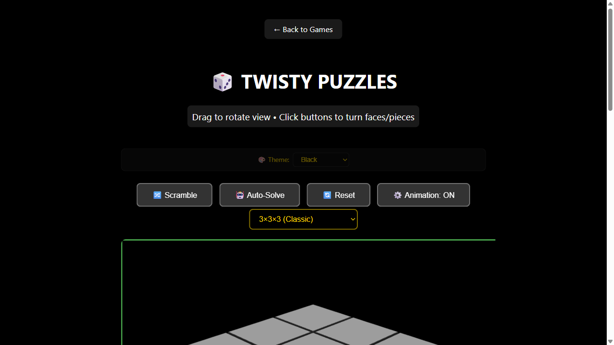
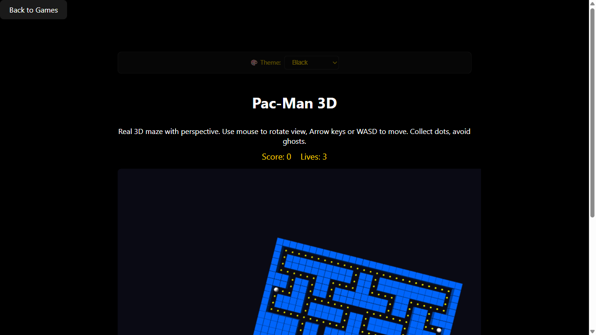
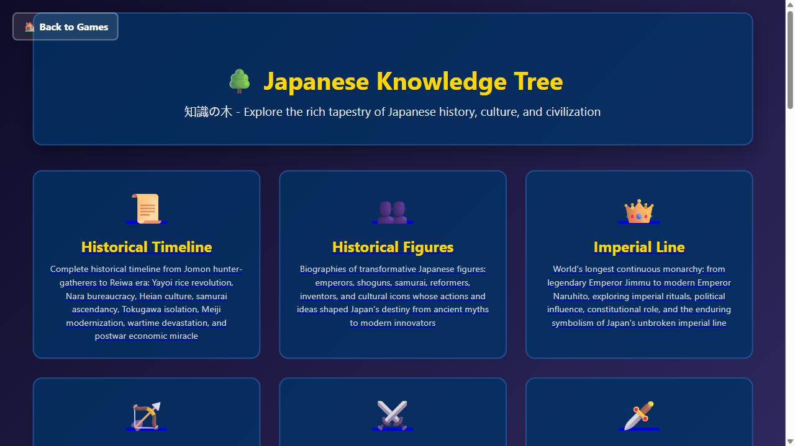

# Games Collection

**150+ browser games + Japanese learning suite + AI game engines + FastMCP server + Tauri 2.0 desktop app.**

A personal monorepo combining a large browser game collection with professional AI engine integration (Stockfish 16, KataGo, YaneuraOu), a FastMCP 3.2 server for AI-assisted play, and a Tauri 2.0 native wrapper.

---

## Preview


*150+ games across 12 categories — board, arcade, card, casino, puzzle, Japanese learning and more.*

| Unusual games | |
|---------------|--|
|  |  |
| *3D Chess with Three.js board* | *Star Trek TDC — 7-board logic* |
|  |  |
| *3D Rubik's Cube with auto-solver* | *Pac-Man in a 3D maze* |
|  |  |
| *Japanese flower cards (Hanafuda)* | *Austrian card classic (Schnapsen)* |
|  |
| *Japanese Knowledge Tree — culture, history & trivia explorer* |

---

## Features

- **150+ browser games** — arcade, board, card, casino, strategy, puzzle, multiplayer
- **Japanese learning suite** — kanji wall (2,500), JLPT N5-N1 drills, flashcards, vocabulary
- **Professional AI engines** — Stockfish 16 (chess), KataGo (Go), YaneuraOu (shogi)
- **FastMCP 3.2 server** — 8+ tools for game analysis, AI moves, tournaments, coaching
- **Tauri 2.0 native desktop** — single NSIS installer, embedded PyInstaller backend
- **P2P multiplayer** — Firebase Realtime Database for global sessions
- **Dockerized** — gateway + engine containers with docker-compose
- **SOTA compliance** — Ruff linting, TypeScript typecheck, Playwright e2e

---

## Quick Install

**Fastest path (requires uv + just):**

```powershell
git clone https://github.com/sandraschi/games-app
cd games-app
just serve
```

Open `http://localhost:10986` in your browser.

For the native desktop app, see [INSTALL.md](INSTALL.md) — Option E (Tauri NSIS).

---

## What You Can Do

```
Show me the top 10 games by play count
Analyze this chess position: rnbqkbnr/pppppppp/8/8/8/8/PPPPPPPP/RNBQKBNR
Start a new shogi game and tell me the best opening
Create a tournament for chess with 4 players and blitz time control
Design a 4-week coaching program to improve my endgame
```

---

## Documentation

| Topic | Document |
|-------|----------|
| Installation (all methods) | [INSTALL.md](INSTALL.md) |
| Changelog | [CHANGELOG.md](CHANGELOG.md) |
| MCP server docs | [games-mcp/README.md](games-mcp/README.md) |
| Configuration | [docs/CONFIGURATION.md](docs/CONFIGURATION.md) |
| Development guide | [docs/DEVELOPMENT.md](docs/DEVELOPMENT.md) |
| Troubleshooting | [docs/TROUBLESHOOTING.md](docs/TROUBLESHOOTING.md) |
| Full doc index | [docs/README.md](docs/README.md) |
| Roadmap | [docs/ROADMAP.md](docs/ROADMAP.md) |
| Tech stack | [docs/TECH_STACK.md](docs/TECH_STACK.md) |
| Architecture | [docs/HOW_THIS_IS_BUILT.md](docs/HOW_THIS_IS_BUILT.md) |
| Webapp overview | [docs/README_WEBAPP.md](docs/README_WEBAPP.md) |

---

## Requirements

| Dependency | Version | Install |
|------------|---------|---------|
| Python | 3.13+ | `winget install Python.Python.3.13` |
| uv | latest | `winget install astral-sh.uv` |
| Node.js | 20+ | `winget install OpenJS.NodeJS.LTS` |
| just | latest | `winget install Casey.Just` |
| Rust (Tauri) | 1.80+ | `winget install Rustlang.Rustup` |

---

## License

MIT

---

## Fleet compliance

| Requirement | Status |
|-------------|--------|
| FastMCP 3.2 | Yes |
| Tauri 2.0 desktop app | Yes |
| Docker compose | Yes |
| Playwright e2e | Yes |
| Ruff lint + fix | Yes |
| TypeScript typecheck | Yes |
| llms.txt + llms-full.txt | Yes |
| glama.json | Yes |
| start.ps1 + start.bat | Yes |
| justfile | Yes |
| uv.lock | Yes |
