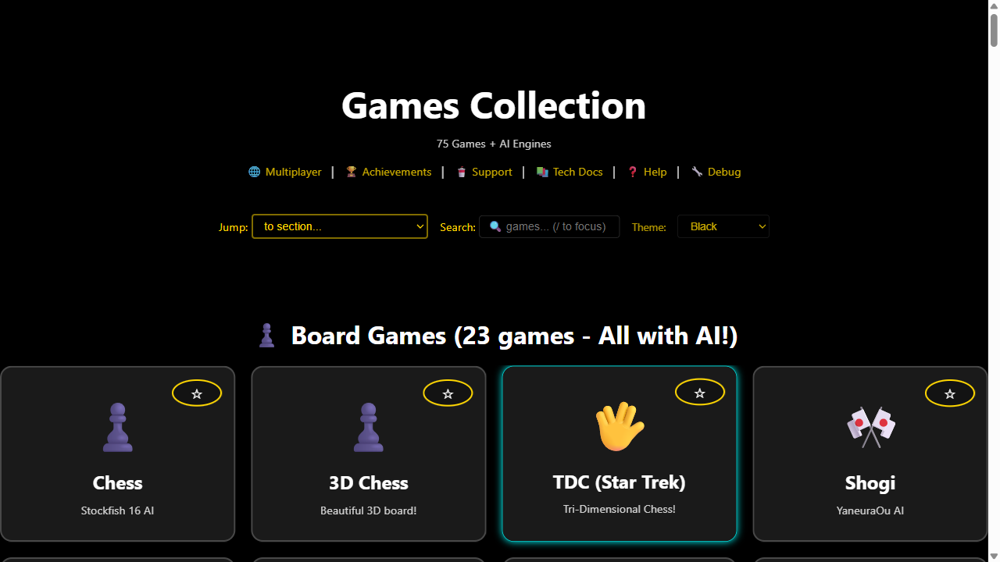
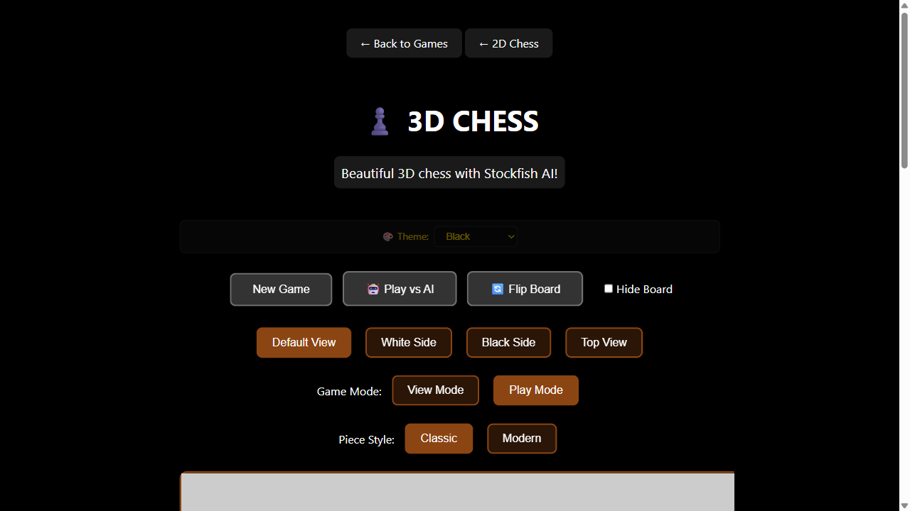
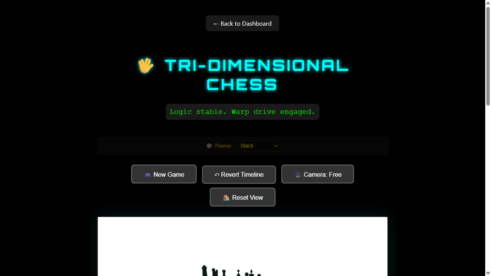
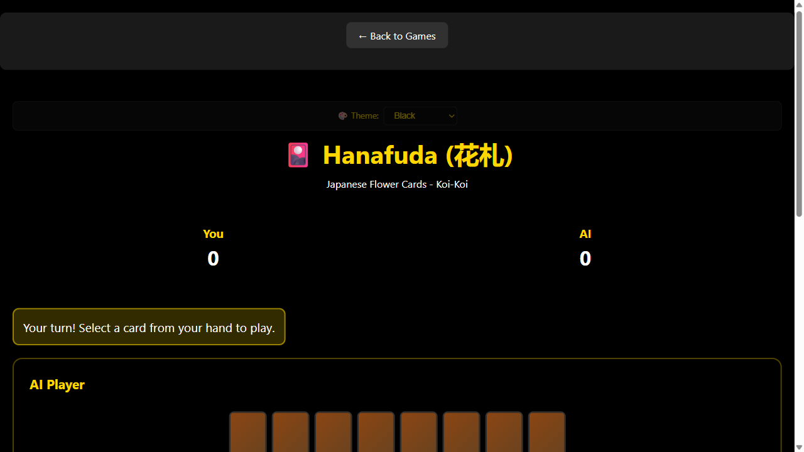
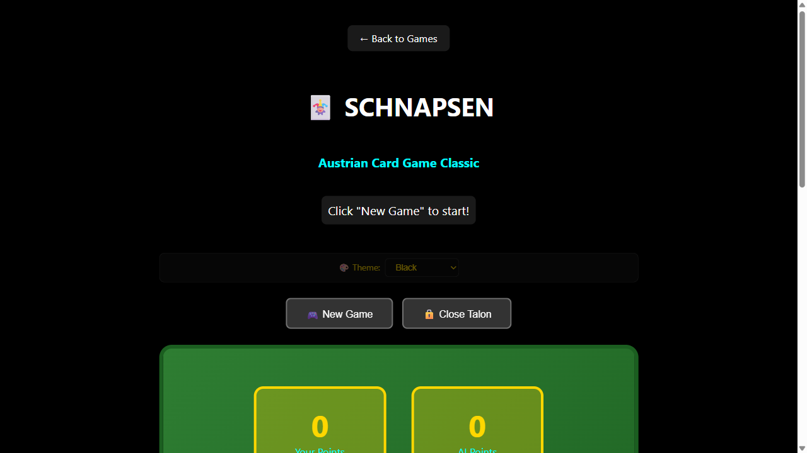

# AI Game Chest

A local-first AI games collection: 50+ browser games, AI opponents with real engines, and 107 OpenSpiel games. All running on your machine — no accounts, no ads, no cloud.

> **Chess with Stockfish 16 (3500+ Elo) · Go with KataGo · Shogi with YaneuraOu · Othello with Edax 4.6**
> **Backgammon with GNU Backgammon · Hex with MoHex · 119 games via OpenSpiel**
> **Japanese: kanji, JLPT N5-N1, flashcards, vocabulary · 23 board games, 19 arcade, 10+ card games**

---

## Why This Exists

This started as an experiment: **how far can agentic engineering go?** Not "vibecoding" — deliberate, iterative, push-the-limits AI-assisted development. The result is a full-featured games platform with 150+ games, seven AI engines, 3D physics, and an MCP API. All built in days, not months. This repo is the artifact of that question.

**The AI opponent irony.** Every AI engine here — Stockfish, KataGo, Edax, MoHex, GNU Backgammon — was built by human researchers over decades. Not a single line of their game-playing code was written by AI. They're classical algorithms: alpha-beta pruning, Monte Carlo tree search, neural network evaluation. Yet they are *artificial intelligence* in the truest sense. This project respects that enormous human effort and wraps it in a modern interface so it doesn't rot in a terminal.

**Agent-accessible.** Every game is also an MCP tool. Claude, Cursor, or any MCP client can analyze chess positions, play a round of Hex, or run a Go analysis. The `/mcp` endpoint exposes the entire collection programmatically. Games become building blocks for autonomous agents.

**Local first.** Everything runs on your machine. No account creation, no data collection, no ads, no monthly subscription. Start the server, open the browser, play.

**107+ game research library.** OpenSpiel is an academic framework from Google DeepMind. This is the only browser UI for it — you can play Phantom Tic-Tac-Toe, Liar's Dice, Breakthrough, and 100+ other games that exist nowhere else as clickable web pages.

**3D physics for the sake of it.** Jenga with Cannon.js physics. Mahjong with Three.js orbit controls. The kind of thing you build when you're not optimizing for mobile battery life.

---

## SOTA Components

This repo doubles as a working portfolio of current-generation engineering practices:

| Layer | Technology | What it does |
|-------|-----------|-------------|
| **Web framework** | React 19 + Vite 7 + TypeScript 5.9 | Modern SPA, instant HMR |
| **3D rendering** | Three.js r128 + Cannon.js | Jenga physics, Mahjong orbit controls |
| **Canvas** | Custom 2D canvas | Hex board, Jigsaw puzzle pieces |
| **Backend** | FastAPI + FastMCP 3.2 | REST API + MCP dual transport |
| **AI/ML** | Stockfish 16, KataGo, MCTS, Edax, MoHex, GNU Bg | Classical game AI (not LLM) |
| **Academic** | OpenSpiel 1.6 (Google DeepMind) | 107 game environments with MCTS |
| **Desktop** | Tauri 2.0 + NSIS | Single-installer Windows app |
| **Build** | PyInstaller (frozen backend) | Standalone .exe, no Python runtime |
| **Container** | Docker Compose | Full stack engine deployment |
| **Package** | uv (Astral) | Lockfile-venv Python management |
| **CI** | GitHub Actions | Lint, typecheck, test, build |
| **Task runner** | Justfile | 15+ recipes for dev/build/test |
| **E2E** | Playwright | Automated browser tests |
| **MCP** | Model Context Protocol | Agent-accessible game API |
| **PWA** | Service worker + manifest | Offline-capable, installable |
| **Multiplayer** | WebSocket + Firebase | Real-time P2P game sessions |
| **Quality** | Ruff, tsc --noEmit, Bandit | Lint, typecheck, security audit |
| **Git** | Conventional commits | Structured changelog generation |
| **Styling** | CSS custom properties + dark theme | Consistent dark UI, no framework |

---

## Table of Contents

- [Preview](#preview)
- [Features](#features)
- [Quick Install](#quick-install)
- [What You Can Do](#what-you-can-do)
- [Game Collection](docs/README_GAMES.md)
- [Japanese Learning](docs/README_JAPANESE.md)
- [MCP Server](games-mcp/README.md)
- [Documentation](#documentation)
- [Requirements](#requirements)
- [License](#license)

---

## Preview


*50+ games across 12 categories.*

| | |
|---|---|
|  |  |
| *3D Chess with Three.js* | *Star Trek TDC* |
|  |  |
| *Japanese flower cards* | *Austrian card classic* |

---

## Features

- **Play against real AI** — Stockfish 16 (chess), KataGo (Go), YaneuraOu (shogi), Edax 4.6 (Othello), GNU Backgammon, MoHex (Hex), OpenSpiel (119 games). No JavaScript toy engines.
- **50+ browser games** — chess, Go, shogi, poker, mahjong, arcade, puzzles, card games
- **Learn Japanese** — 2,500 kanji, JLPT practice (N5-N1), spaced-repetition flashcards
- **MCP tools for agents** — 14 FastMCP 3.2 tools for game analysis, coaching, tournaments
- **Desktop app** — Tauri 2.0, single NSIS installer, everything embedded
- **Docker** — all engines + gateway in containers
- **P2P multiplayer** — Firebase-synced sessions for global play

---

## Game AI Engines

All engines run in Docker containers (orchestrated via `docker-compose.yml`) or natively on Windows. Each engine has a Python aiohttp server wrapper exposing a REST API on its port.

| Engine | Game | Version | License | Port | Windows Native | Docker Required? |
|--------|------|---------|---------|------|----------------|------------------|
| Stockfish | Chess | 16 | GPL-3.0 | 10780 | ✅ | No |
| YaneuraOu | Shogi | 9.40 (Deep ORT-CPU) | GPL-3.0 | 10781 | ✅ | No |
| KataGo | Go | 1.16.5 (OpenCL) | MIT | 10782 | ✅ | No |
| Edax | Othello/Reversi | 4.6 | GPL-3.0 | 10785 | ✅ `engines/data/` | No |
| OpenSpiel | 119 games | 1.6.15 | Apache-2.0 | 10787 | ✅ (pip) | No |
| GNU Backgammon | Backgammon | 1.08 | GPL-3.0 | 10786 | ❌ | **Yes** |
| MoHex | Hex | Built from source | LGPL-3.0 | 10775 | ❌ | **Yes** |

**Start all engines:**

```powershell
docker compose up -d
```

**Naked-PC alternative** (run engine servers directly without Docker):

```powershell
uv run python engines/stockfish-server.py
uv run python engines/shogi-server.py
uv run python engines/go-server.py
uv run python engines/edax-server.py
uv run python engines/gnubg-server.py
uv run python engines/open_spiel_server.py
uv run python engines/mohex-server.py
```

---

## Quick Install

```powershell
git clone https://github.com/sandraschi/ai-game-chest
cd ai-game-chest
.\start.ps1
```

This launches all seven AI engines + the game gateway. Opens `http://localhost:10987/`.

For other install methods (manual, Docker, Tauri desktop), see [INSTALL.md](INSTALL.md).

---

## What You Can Do

```
Play a game of chess against Stockfish at level 15
Study kanji stroke order for JLPT N3 vocabulary
Challenge KataGo to a 9x9 Go game
Browse the arcade — 19 classic games from Snake to Pac-Man
Open the MCP dashboard at http://localhost:10986
```

---

## Game Collection

Arcade, board, card, casino, puzzle, strategy, and multiplayer games — all in your browser. [Browse the collection](docs/README_GAMES.md).

## Japanese Learning

Kanji wall (2,500), JLPT N5-N1 test drills, vocabulary with spaced repetition, stroke order, grammar, and listening practice. [Start learning](docs/README_JAPANESE.md).

## MCP Server

FastMCP 3.2 server with 14 tools for AI-assisted game analysis, coaching, tournaments, and P2P multiplayer. [Server docs](games-mcp/README.md).

---

## Documentation

| Topic | Where |
|-------|-------|
| Install (all methods) | [INSTALL.md](INSTALL.md) |
| Changelog | [CHANGELOG.md](CHANGELOG.md) |
| Game collection | [docs/README_GAMES.md](docs/README_GAMES.md) |
| Japanese learning | [docs/README_JAPANESE.md](docs/README_JAPANESE.md) |
| MCP server | [games-mcp/README.md](games-mcp/README.md) |
| Configuration | [docs/CONFIGURATION.md](docs/CONFIGURATION.md) |
| Development | [docs/DEVELOPMENT.md](docs/DEVELOPMENT.md) |
| Troubleshooting | [docs/TROUBLESHOOTING.md](docs/TROUBLESHOOTING.md) |
| Product requirements | [docs/PRD.md](docs/PRD.md) |
| Full index | [docs/README.md](docs/README.md) |

---

## Requirements

| Dependency | Install |
|------------|---------|
| Python 3.13+ | `winget install Python.Python.3.13` |
| uv | `winget install astral-sh.uv` |
| Node.js 20+ | `winget install OpenJS.NodeJS.LTS` |
| just | `winget install Casey.Just` |

---

## References

A full bibliography covering the AI engines, game theory, neurobiology of decision-making, game philosophy, and technical foundations is in [`REFERENCES.md`](REFERENCES.md). Highlights:

- **OpenSpiel:** Lanctot et al., "A Framework for Reinforcement Learning in Games" — [arXiv:1908.09453](https://arxiv.org/abs/1908.09453)
- **Stockfish:** Romstad et al., open-source chess engine — [stockfishchess.org](https://stockfishchess.org/)
- **KataGo:** Wu, "A Distributed Training Approach for Computer Go" — [GitHub](https://github.com/lightvector/KataGo)
- **MCTS:** Browne et al., "A Survey of Monte Carlo Tree Search Methods" — [IEEE CIG](https://ieeexplore.ieee.org/document/6145622)
- **Game philosophy:** Huizinga, *Homo Ludens* (1938); Suits, *The Grasshopper* (1978); Caillois, *Man, Play and Games* (1961)
- **Game theory:** von Neumann & Morgenstern (1944); Nash (1950)
- **Decision neuroscience:** Kahneman, *Thinking, Fast and Slow* (2011); Damasio, *Descartes' Error* (1994)

---

## License

MIT
