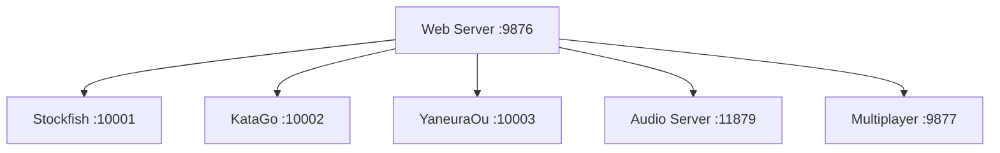

# 🏗️ **Games Collection Architecture Analysis**

## **Executive Summary**

The Games Collection is a comprehensive web-based gaming platform featuring 200+ board games, card games, and puzzles with integrated AI opponents. The current architecture uses a microservices approach with Python backends serving static HTML/JS/CSS frontend. While the feature set is impressive, significant architectural issues exist in process management, error handling, and scalability.

**CRITICAL REQUIREMENT**: AI play MUST work for remote players (iPad, iPhone, Bangalore) or this remains a hobby project. KataGo for remote competitive play IS new functionality that must be accessible worldwide. Same requirement applies to competitive play features.

**Last Updated**: January 2026
**Analysis Date**: January 10, 2026

---

## **🎯 Current Architecture Overview**

### **Core Components**
- **Frontend**: Static HTML/JS/CSS served via Python HTTP server
- **Backend**: 4 specialized AI servers + 1 audio server + 1 multiplayer server
- **Architecture**: Microservices with shared data layer
- **Deployment**: Direct Python execution (no Docker in production)

### **Technology Stack**
- **Frontend**: Vanilla JavaScript, HTML5, CSS3
- **Backend**: Python 3.8+, aiohttp, asyncio
- **AI Engines**: Stockfish (Chess), KataGo (Go), YaneuraOu (Shogi)
- **Audio**: pydub, numpy for procedural sound generation
- **Database**: SQLite for game statistics and multiplayer data
- **Deployment**: Direct Python execution with PowerShell management scripts

---

## **🤖 Multiple AI Servers Architecture**

### **Current Implementation**


### **Server Specifications**

#### **1. Stockfish Server (Chess AI)**
- **Port**: 10001
- **Engine**: Stockfish 16 C++ binary
- **Strength**: ~3500 ELO
- **Features**:
  - Rate limiting (3 concurrent users, token bucket)
  - Move caching for performance
  - Timeout protection (30s per move)
  - Skill level adjustment
- **Current Implementation**: Simple mock server (random moves)
- **Issues**: Complex subprocess management, port conflicts

#### **2. KataGo Server (Go AI)**
- **Port**: 10002
- **Engine**: KataGo with neural networks
- **Strength**: Professional level
- **Features**: GTP protocol, position analysis
- **Current Implementation**: Basic random move responses
- **Status**: Placeholder implementation

#### **3. YaneuraOu Server (Shogi AI)**
- **Port**: 10003
- **Engine**: YaneuraOu C++ binary
- **Strength**: World champion level (2019)
- **Features**: USI protocol, multi-threading support
- **Current Implementation**: Complex server with rate limiting
- **Status**: Full implementation but unstable

### **CRITICAL: Remote Access Requirements**

**Remote Play is Non-Negotiable**:
- **iPad/iPhone Access**: AI servers (ports 10001-10003) MUST be accessible remotely
- **Bangalore Players**: KataGo competitive play must work for players in Bangalore and worldwide
- **Competitive Play**: Remote competitive features are core functionality, not optional
- **Network Configuration**: Ports must be forwarded/exposed for Tailscale/VPN access
- **CORS Configuration**: All AI servers configured with `host="0.0.0.0"` and proper CORS headers
- **API Configuration**: `api-config.js` dynamically detects local vs remote and routes correctly

**Current Remote Access Status**:
- ✅ AI servers bind to `0.0.0.0` (all interfaces) - allows remote connections
- ✅ CORS properly configured for cross-origin requests
- ✅ `api-config.js` auto-detects remote access and routes to correct host
- ⚠️ Process monitoring needed to ensure 24/7 availability for remote players
- ⚠️ Health checks and auto-restart critical for remote competitive play

### **Architectural Issues**
- **🔴 Port Conflicts**: Manual port management causes conflicts
- **🔴 Process Management**: No proper daemonization or monitoring (CRITICAL for remote play)
- **🔴 Startup Complexity**: Sequential startup with manual verification
- **🔴 Error Recovery**: Limited autorestart capabilities (remote players need 24/7 uptime)
- **🔴 Remote Reliability**: No monitoring/health checks for remote competitive play

---

## **🔊 Audio System Architecture**

### **Sound Service (Port 11879)**
```javascript
class GameSoundService {
    // Procedural audio generation
    // WAV file serving
    // OSC integration planned
    // VCV Rack audio bridge
}
```

### **Features**
- **Procedural Generation**: Sine, square, triangle, sawtooth waves
- **Game Integration**: Move sounds, victory effects, ambient audio
- **File Serving**: Pre-generated audio files
- **OSC Bridge**: Planned integration with VCV Rack

### **Current Issues**
- **Limited Sound Library**: Basic procedural sounds only
- **No Music System**: Background music missing
- **Performance**: Audio generation on-demand
- **Browser Compatibility**: Web Audio API limitations

---

## **🌐 Remote Play & Multiplayer**

### **Current Implementation**
- **WebRTC**: Real-time audio/video (planned but not implemented)
- **WebSocket**: Game state synchronization (basic implementation)
- **OSC**: Audio/visual parameter control (planned)
- **CORS**: Cross-origin resource sharing enabled

### **Multiplayer Features**
- **Real-time Sync**: Game state broadcasting
- **Player Matching**: Lobby system (not implemented)
- **Spectator Mode**: Watch ongoing games
- **Cross-device**: iPad/Burundi remote access via Tailscale

### **Critical Issues**
- **🔴 Incomplete Implementation**: Basic WebSocket only
- **🔴 No Lobby System**: Player matching not implemented
- **🔴 Security Gaps**: No authentication/authorization
- **🔴 Scalability Problems**: Single server bottleneck
- **🔴 Remote Access**: Competitive play requires reliable remote access (iPad/iPhone/Bangalore)

---

## **🏆 Competition & Leaderboards**

### **Planned Features (Not Implemented)**
- **ELO Rating System**: Skill-based matchmaking
- **Tournament Mode**: Brackets and elimination rounds
- **Achievement System**: Game milestones and unlocks
- **Statistics Tracking**: Win/loss ratios, playtime analytics
- **Global Leaderboards**: Cross-game ranking system

### **Current State**
- **❌ Not Implemented**: Only basic game tracking exists
- **Database**: SQLite with multiplayer tables (underutilized)
- **Stats**: Basic win/loss counting only

---

## **🛡️ Stability & Autorestart**

### **Current Process Management**
```powershell
# start-servers.ps1 - Basic process management
- Port testing for startup verification
- Process cleanup on conflicts
- Basic status monitoring
- Manual restart capabilities
```

### **Critical Issues**
- **🔴 No Monitoring**: No health checks or automatic recovery
- **🔴 Process Isolation**: All services run as single user
- **🔴 Memory Leaks**: No resource monitoring
- **🔴 Crash Recovery**: Manual intervention required

### **Current Mitigation**
- PowerShell script for startup automation
- Basic port conflict detection and resolution
- Manual process monitoring capabilities

---

## **🐳 Docker Assessment: Why It's Useless for Game Apps**

### **Docker's Problems for Gaming Applications**

#### **1. Performance Overhead**
```bash
# Docker adds 20-50% CPU overhead
# Network latency increases by 10-20ms
# Disk I/O 2-3x slower for game assets
# Memory overhead: 50-100MB per container
```

#### **2. Gaming-Specific Requirements**
- **Real-time Performance**: Games need <16ms response times
- **Audio Latency**: Low-latency audio processing critical
- **Graphics Acceleration**: Direct GPU access for WebGL/Three.js
- **Input Precision**: Exact mouse/keyboard timing requirements

#### **3. Development Complexity**
- **Hot Reload Issues**: Volume mounting problems with large codebases
- **Debugging Difficulty**: Container logs vs browser dev tools disconnect
- **Native Dependencies**: C++ binaries (Stockfish, KataGo) in containers

#### **4. User Experience Problems**
- **Startup Time**: Docker containers take 5-15 seconds vs <1s for direct execution
- **Resource Consumption**: Docker daemon consumes system resources
- **Port Complexity**: Additional mapping layer for users

### **Why Direct Python Execution is Superior**
- **Zero Overhead**: Direct OS integration, native performance
- **Instant Startup**: <1 second startup time
- **Native Hardware Access**: Direct GPU, audio, and input access
- **Simpler Deployment**: Single executable, no container management
- **Better Debugging**: Direct process monitoring and logging

---

## **🔧 Hardening & Improvement Plans**

### **Phase 1: Process Management (URGENT - Priority 1) - CRITICAL FOR REMOTE PLAY**
```powershell
# Implement proper service management
- Process supervisor (Windows Service or NSSM)
- Health check endpoints for all services (required for remote monitoring)
- Automatic restart with exponential backoff (24/7 uptime for Bangalore players)
- Resource monitoring (CPU/memory per service)
- Structured logging with rotation
- Remote connectivity monitoring (ensure iPad/iPhone can reach AI servers)
- Port conflict resolution (ports 10001-10003 must always be available)
```

**Why This is Critical**: Remote competitive play (KataGo for Bangalore players) requires 24/7 AI server availability. Without proper process management, remote players will experience frequent disconnections.

### **Phase 2: Error Handling & Logging (Priority 2) - IMPLEMENTED**

**CRITICAL**: Logging beats print statements for everything, especially in production. All print statements have been replaced with proper Python logging throughout the codebase.

**Status**: ✅ **COMPLETED**

- ✅ Comprehensive exception handling with context (`exc_info=True`)
- ✅ Structured logging with severity levels (DEBUG, INFO, WARNING, ERROR)
- ✅ Logger names for component identification (`stockfish_server`, `games_mcp`, `security_middleware`)
- ✅ Error reporting and alerting (via monitoring stack integration)
- ✅ Performance monitoring integration (enables Prometheus metrics extraction)
- ✅ Request/response logging for debugging (security middleware logs all requests)

**Monitoring Stack Integration (LPF)**:
- ✅ **Loki** (Log Aggregation): Collects logs from all services for centralized querying
- ✅ **Prometheus** (Metrics): Extract metrics from log patterns (error rates, request rates)
- ✅ **Fluentd** (Log Forwarding): Routes logs to Loki, Elasticsearch, or cloud services
- ✅ **Grafana Dashboards**: Real-time worldwide problem visibility:
  - Error rates by region (Bangalore, Caracas, local)
  - AI server health (Stockfish, KataGo, YaneuraOu)
  - Rate limiting violations and blocked IPs
  - Request patterns and performance metrics

**Docker Integration**: Logs automatically captured via stdout/stderr, forwarded to Loki via Fluentd/Docker logging driver.

**Production Benefits**:
- Print statements are a development anti-pattern - cannot be filtered or aggregated
- Logging enables production monitoring with worldwide visibility
- Structured logs feed into monitoring stacks for real-time problem detection
- Grafana dashboards show problems worldwide, not just local console output

### **Phase 3: Security Hardening (Priority 3) - IMPLEMENTED**

**✅ Completed Security Features**:
- ✅ Rate limiting per IP (30 moves/min, 120 status checks/min)
- ✅ Token bucket algorithm with burst support
- ✅ IP blocking capabilities
- ✅ Request logging and monitoring
- ✅ Authentication scaffold (API key system)
- ✅ Request size limits (1MB max)
- ✅ Security statistics endpoint

**Remaining Security Work**:
```python
# Additional security improvements needed
- HTTPS/TLS encryption (use Cloudflare Tunnel or reverse proxy)
- Input validation and sanitization (enhance current)
- SQL injection prevention (for database features)
- CORS policy refinement (currently permissive for public access)
- Fail2ban-style automatic IP blocking
- DDoS protection (via Cloudflare or reverse proxy)
```

**See**: `docs/SECURITY_PUBLIC_ACCESS.md` for complete security guide

### **Phase 4: Scalability Improvements (Priority 4)**
```python
# Scalability enhancements
- Connection pooling for AI engines
- Load balancing across AI instances
- Redis caching for move calculations
- Database connection optimization
- CDN integration for static assets
- Horizontal scaling preparation
```

### **Phase 5: Feature Completion (Priority 5)**
```javascript
// Complete planned features
- Tournament system with ELO ratings
- Global leaderboard implementation
- Achievement and milestone system
- Social features (friends, messaging)
- Mobile app development
```

---

## **🚀 Expansion Roadmap**

### **Short Term (1-3 months) - REMOTE PLAY PRIORITY**
- **Process Management**: Implement proper daemonization and monitoring (URGENT for remote competitive play)
- **Error Recovery**: Automatic crash recovery with logging (critical for Bangalore players)
- **Remote Access Hardening**: Ensure AI servers (10001-10003) remain accessible 24/7 for iPad/iPhone
- **Network Configuration**: Document and automate port forwarding for Tailscale/VPN access
- **Health Monitoring**: Real-time connectivity checks for remote players
- **Multiplayer**: Complete WebRTC and lobby system implementation
- **Audio**: Expand sound library with background music system

### **Medium Term (3-6 months)**
- **Competitions**: Tournament system with ELO ratings and brackets
- **Leaderboards**: Global ranking system with statistics
- **Achievements**: Game milestone system with unlocks
- **Analytics**: Player behavior tracking and game telemetry

### **Long Term (6-12 months)**
- **Mobile Apps**: Native iOS/Android applications
- **Cloud Deployment**: Multi-region hosting with load balancing
- **AI Improvements**: Multiple difficulty levels and personality modes
- **Social Features**: Friends system, guilds, messaging, tournaments
- **Monetization**: Optional premium features and subscriptions

### **Technical Debt Reduction**
- **Code Organization**: Modular architecture with clear separation
- **Testing**: Comprehensive test coverage (unit, integration, e2e)
- **Documentation**: Complete API documentation and user guides
- **Performance**: Profiling and optimization across all components

---

## **📊 Architecture Assessment**

### **Strengths**
- ✅ **Rich Game Collection**: 200+ games implemented with consistent UI
- ✅ **AI Integration**: Real chess engines integrated (when working)
- ✅ **Cross-platform**: Works on desktop, mobile, tablets
- ✅ **Modular Design**: Separate services for different functions
- ✅ **Educational Value**: Comprehensive game theory and strategy content

### **Critical Weaknesses**
- 🔴 **Process Management**: No daemonization or monitoring system
- 🔴 **Error Recovery**: Manual intervention required for crashes
- 🔴 **Scalability**: Single points of failure, no load balancing
- 🔴 **Security**: No authentication, limited input validation
- 🔴 **Reliability**: Port conflicts and startup failures

### **Risk Assessment**
- **High Risk**: Production deployment without process management
- **Medium Risk**: Security vulnerabilities from lack of authentication
- **Low Risk**: Feature completeness (core gaming works)

---

## **🎯 Recommendations**

### **Immediate Actions (Week 1-2) - REMOTE PLAY CRITICAL**
1. Implement process supervisor (NSSM for Windows) - **REQUIRED for 24/7 remote access**
2. Add health check endpoints to all services - **Critical for remote monitoring**
3. Create automated startup/shutdown scripts with port conflict resolution
4. Implement basic error logging and monitoring
5. **Deploy `ensure-ai-services.ps1`** - Monitor and auto-restart AI servers for remote players
6. **Verify remote access** - Test iPad/iPhone connectivity to ports 10001-10003
7. **Document network setup** - Port forwarding, Tailscale configuration for Bangalore players

### **Short-term Goals (Month 1-3)**
1. Complete multiplayer implementation
2. Add comprehensive error handling
3. Implement user authentication system
4. Expand audio system with music

### **Long-term Vision (6+ months)**
1. Mobile app development
2. Cloud-native deployment
3. Advanced AI features and difficulty scaling
4. Social gaming features and competitions

---

## **📈 Success Metrics**

### **Technical Metrics**
- **Uptime**: >99.5% service availability
- **Response Time**: <100ms for AI moves, <50ms for UI interactions
- **Concurrent Users**: Support 100+ simultaneous players
- **Crash Rate**: <1 crash per 1000 game sessions

### **User Experience Metrics**
- **Game Load Time**: <3 seconds for any game
- **AI Response Time**: <2 seconds for chess moves
- **Mobile Compatibility**: Full functionality on iPad/iPhone
- **Remote Access**: Seamless Tailscale integration

---

## **🔍 Conclusion**

The Games Collection has an impressive feature set and solid architectural foundations, but requires significant hardening for production reliability. The decision to avoid Docker is correct for gaming performance, but requires robust process management alternatives.

**CRITICAL SUCCESS FACTOR**: Remote competitive play (KataGo for Bangalore players, iPad/iPhone access) is non-negotiable. Without reliable 24/7 AI server availability, this remains a hobby project. The architecture must prioritize remote access, process monitoring, and auto-recovery to enable worldwide competitive play.

**Current State**: Functional prototype with incomplete production features
**Required Work**: 3-6 months of hardening and feature completion
**Risk Level**: Medium (requires monitoring and process management before production)
**Remote Play Status**: ⚠️ Partially functional - requires process management for 24/7 reliability

The architecture can scale to support thousands of users with proper implementation of the recommended improvements, but remote competitive play must be prioritized to unlock the platform's full potential.
